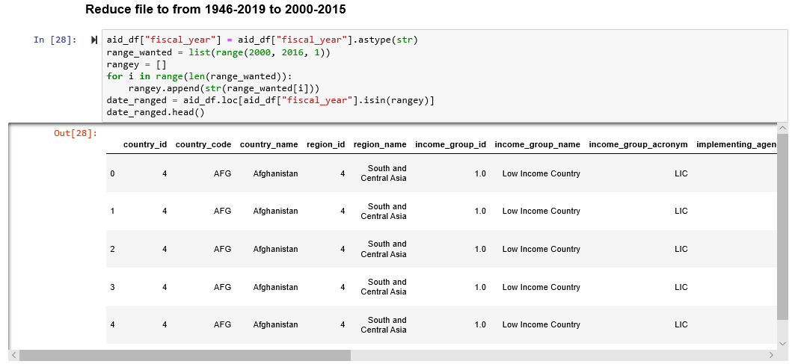
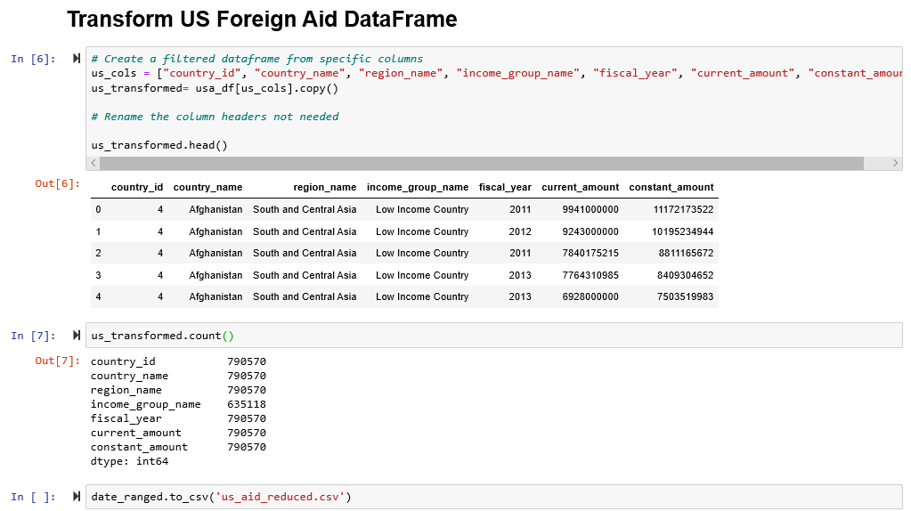

# Life Expectancy by country and US foreign aid provided 2000-2015

## Introduction
As you can read from the title, the table we built is designed to provide the life expectancy of a country along with the amount of US foreign aid it provides within that same year. The title is intentionally long so as to be descriptive, so when uploaded on a website like [data.world](https://data.world/) or [Kaggle](https://www.kaggle.com/) it would be easy to identify the type of data it contains. We will now go through our **E**xtract, **T**ransform and **L**oad process.

## Extract
Life Expectancy: Original file name “Life Expectancy by Country and Year (2000 - 2015)”, CSV File, found on Kaggle, address: https://www.kaggle.com/kumarajarshi/life-expectancy-who
* Data for Life expectancy came from a trusted source; World Health Organization (WHO). The data included economic as well as health data for 193 countries for the years 2000 - 2015, which we believe provided a rich data set.

US Aid: Original File name “us_foreign_aid_complete”, CSV File, found on USAID.gov website, address: https://www.usaid.gov/results-and-data/data-resources
* The US Aid data came directly from the USAID website with in-depth data-points on country, region and humanitarian-type information for over 170 years. This actually became a hinderance considering the file size, but aligned well with our data from from WHO's life expectancy index.

## Transform

### Life Expectancy 
CSV file was transformed into a DataFrame using Pandas in Python on a Jupyter Notebook. From there the columns that we felt would be useful for various studies were filtered. Then renamed so all columns were lower-case and without spacing, to simplify data extraction on various tools (e.g. SQL).

### US Aid
This CSV took considerably more work to clean as the original file carried many years of data outside of our target range of 2000-2015 (target chosen because it coincides with the data provided from Life Expectancy) and also carried many rows of data that would be superfluous to users outside of a US government aid agency. 

The file itself was over 600MB, which cannot be uploaded into GitHub, so using Pandas in Python on a Jupyter Notebook we first removed all rows that were outside of our 2000-2015 (the original file went from 1946 to 2019). Then saved this data as a new CSV, with the expectation that it would be small enough to move forward.

However, we learned it was still too large for Git Hub, so did had to decrease the size further. Similar to the Life Expectancy data we used Pandas in Python on Jupyter Notebook to pull only the columns we wanted, finally providing us with a CSV file that was a mere 61MB and could be uploaded into GitHub – called **us_aid_reduced.csv**; which you’ll find in our final Jupyter Notebook.

From there, each country was broken-down many times per year into each aid category that was provided. To simplify our data for later users we had to group each country and year to summate the total US Aid provided per year. This can be found in our final Jupyter Notebook.

## Load

### Database Type
After some deliberation we decided to use a relational table to load the data. This was for two reasons, the first being that we wanted the data to remain structured. Since the data-use is expected for use as-is, a SQL database made the most sense. The second reason being that we all felt the most comfortable using SQL as compared to a non-relational database, such as MangoDB.

### Final Table

The final table **Life Expectancy by county and US foreign aid provided 2000-2015** shortened to file name **life_aid_2000_2015.csv** was created with the following columns ()

This data was chosen for the various use-cases that can be extracted, including:

**Direct Data** -- US Aid Trends Per Country: If someone is doing a study on US Aid to a particular country/countries our table has amalgamated the total aid of each year per country to easily allow comparisons and visualizations.

**Health and Social Impact** -- World Health and/or Prosperity: Using the amount of aid in comparison to life expectancy one could search for correlations between aid provided over certain time periods and see if it has improved life expectancy, reduced child mortality rates, decreased measles infections (health) or increased the level of schooling (social).

**Epidemiology/War/Natural Disaster**-- Aid Spikes: Highly specific uses can also take advantage of this table. For example: an epidemiologist or enthusiast can use the table to find aid spikes in countries and compare it to years of major disease outbreaks, to times of war or times of a natural disaster to see if there were aid spikes in those years and see how health and social levels were impacted during and following those major events.
 
